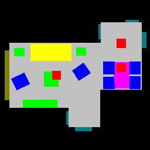

# Indor scene generation
Based on 3D-Front and 3D-Future datasets.

## Installation

Clone this repo.
```bash
git clone https://github.com/valeryefimova/indoor-scene-generation
```

Please install dependencies by
```bash
pip install -r requirements.txt
```

## Dataset Preparation

This code uses [3D-FRONT](https://tianchi.aliyun.com/specials/promotion/alibaba-3d-scene-dataset) and
[3D-FUTURE](https://tianchi.aliyun.com/specials/promotion/alibaba-3d-future) dataset in order to create new synthetic dataset.
After downloading and unzipping, put the dataset in `./3D-FRONT-base/` folder as follows:
* `./3D-FRONT-base/3D-FRONT` should contain 3D-FRONT houses (json files)
* `./3D-FRONT-base/3D-FRONT-texture`should contain 3D-FUTURE models
* `./3D-FRONT-base/3D-FRONT-models` should contain textures provided in 3D-FRONT

In order to create synthetic dataset used by this project, you should run `preprocess.py`. This will create parsed
3D-FRONT dataset with necessary json format. Script `dataset.py` will create room images and associated labels from parsed
dataset. Usage example:

    ```
    python preprocess.py --input 3D-FRONT-base/3D-Front/ --output 3D-FRONT-base/3D-FRONT-parsed/
    python dataset.py --path_to_images gen-images/ --path_to_labels gen-labels/ --path_to_houses 3D-FRONT-base/3D-FRONT-parsed/
    ```

Alternatively, you can download already created dataset from [Google Drive]()



Each room image is 256 by 256 pixels top-down projection. Is consists of several predefined colors (each color denotes furniture type / floor / connection):
* `black` `[0, 0, 0]` Void around room
* `silver` `[192, 192, 192]` Floor
* `teal` `[0, 128, 128]` Doors and holes
* `olive` `[128, 128, 0]` Windows
* `red` `[255, 0, 0]` Lighting
* `blue` `[0, 0, 255]` Chair
* `magneta` `[255, 0, 255]` Table
* `yellow` `[255, 255, 0]` Sofa
* `lime` `[0, 255, 0]` Cabinet/Shelf/Desk
* `purple` `[128, 0, 128]` Bed

Please note that a custom label image can either be an RGB image (which only has floor, void, holes/doors and windows) or
a grayscale image (each pixel associated with void is `0`, floor - `1`, hole/door - `2`, window - `3`). All scripts will automatically
convert RGB-labels to grayscale if they are correctly defined.

## Room image generation
For creating new room images this code uses [SEAN](https://github.com/ZPdesu/SEAN). Download pretrained model from
[Google Drive]() and place it into `./sean/checkpoints/`. On top of that, you should download precalculated [image styles]()
and place them into `./sean/`.
If you want to train new models, please refer to provided [guide](https://github.com/ZPdesu/SEAN#training-new-models).

Executing `generate.py` will generate new room image based on provided label. You can add conditions (e.g. `--bed` argument
forces generated image to include a bed). Example usage:

    ```
    python generate.py --path_to_label examples/label.png --path_to_output examples/ --bed --cabinet --lighting
    ```

Note that label.png can either be RGB or grayscale.

## Rendering rooms
For room rendering [simple-3dviz](https://simple-3dviz.com/) is used. Example usage:

    ```
    python render.py --path_to_image --path_to_label --render_mode auto --style Modern
    ```

List of possible furniture and texture styles:
* `Modern`
* `Chinoiserie`
* `European`
* `Japanese`
* `Industrial`
* `American Country`
* `Vintage/Retro`
* `Light Luxury`
* `Mediterranean`
* `Korean`
* `New Chinese`
* `Nordic`
* `European Classic`
* `Minimalist`
* `Ming Qing`
* `Neoclassical`

